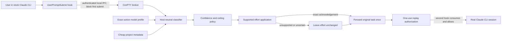
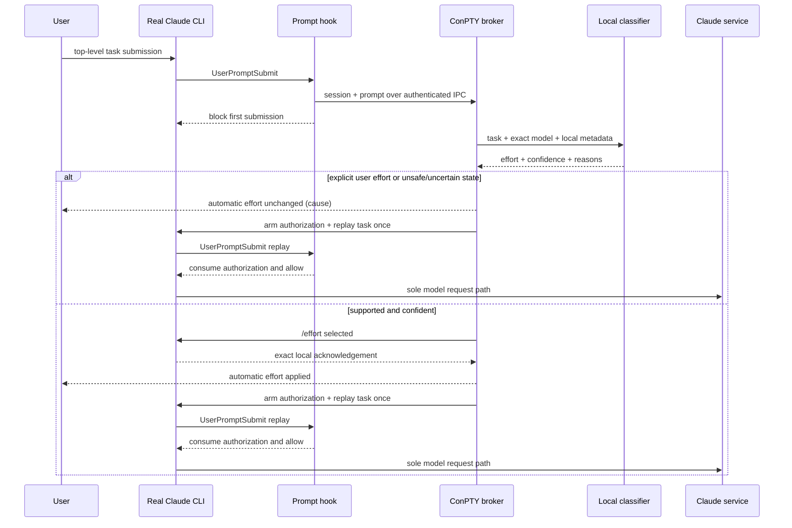

# Architecture

## Target product flow



The broker never changes provider/model and never sends a classification request. It emits prompt-free `applied` or `unchanged` status.

## Implemented versus unresolved

| Layer | State |
| --- | --- |
| `src/core` classifier/profiles | Implemented, deterministic bootstrap |
| `src/broker/turn-controller.js` | Implemented fail-open/exact-once contract |
| `src/broker/hybrid-coordinator.js` | Hook block, ticket routing, one-use replay implemented |
| `src/broker/ipc.js` / `hook-client.js` | Authenticated local named-pipe hook bridge implemented |
| `src/broker/pty-session.js` | Windows ConPTY transport and ANSI-normalized acknowledgement implemented |
| Stock TUI semantic state detector | Resolved by `UserPromptSubmit`; no TUI-byte guessing |
| `/effort` local command/ack | Installed CLI verified at `max`, zero inference |
| `src/gateway/request-transform.js` | Synthetic supported-protocol proof only |
| Global shim/settings installer | Not implemented or authorized |
| Installed zero-inference proof | Passed on Claude Code 2.1.238 |
| Live one-prompt model proof | Not run; requires explicit authorization |

## Broker lifecycle



Both branches are unit-tested. The applied branch was also verified in the installed TUI with a diagnostic second block, so it reached no model. The stock UI visibly renders the first block; the hook API cannot make that interruption silent.

While routing, the eventual broker pauses its stdin relay rather than parsing keystrokes. Permission answers, bracketed paste, Unicode, multiline bytes, and cancellation controls are forwarded unchanged after routing. The relay primitive is implemented and tested; the global runtime is not yet packaged.

## Gateway decision point

The official Anthropic Messages gateway protocol provides a separate safe request boundary:

```text
stock Claude CLI -> loopback gateway -> same Anthropic endpoint/provider
                         |
                         + classify newest natural-language user turn
                         + preserve exact model
                         + mutate output_config.effort only
```

This is supported with `ANTHROPIC_BASE_URL` and a saved claude.ai login, but a real gateway necessarily handles request/auth headers transiently. The current module is transport-free and has no credential/network code.

## Exact-once and privacy boundaries

- The controller guards its single `forwardPrompt` call.
- Classification and metadata never persist or include prompt content.
- A real gateway must hold the request transiently to forward it; it must never log body or auth headers.
- Internal benchmark results contain public task IDs and metrics only and stay ignored under `.effort-autopilot/`.
- The old `--print` launcher/transport is isolated to internal evaluation and is not a product route.

## Model and effort ownership

Exact model is an input, never an output. `SessionStart` supplies the exact id (`claude-opus-5[1m]` in the clean-environment proof). Official docs say that field is optional and does not update after `/model`; the session observer therefore marks the session ambiguous when the `⎿ Set model to …` acknowledgement appears, and every later prompt fails open until a new `SessionStart` supplies an exact model again.

Explicit effort sources outrank automation. Ultracode remains separate orchestration and is suppressed. Unsupported profile/effort mappings are unchanged rather than guessed.

## Platform notes

Windows uses ConPTY through Microsoft's MIT-licensed `node-pty`. macOS/Linux can use the same library over Unix PTYs. Only Windows has been exercised against the installed CLI; cross-platform terminal submission and acknowledgement sequences still require equivalent zero-inference verification.
